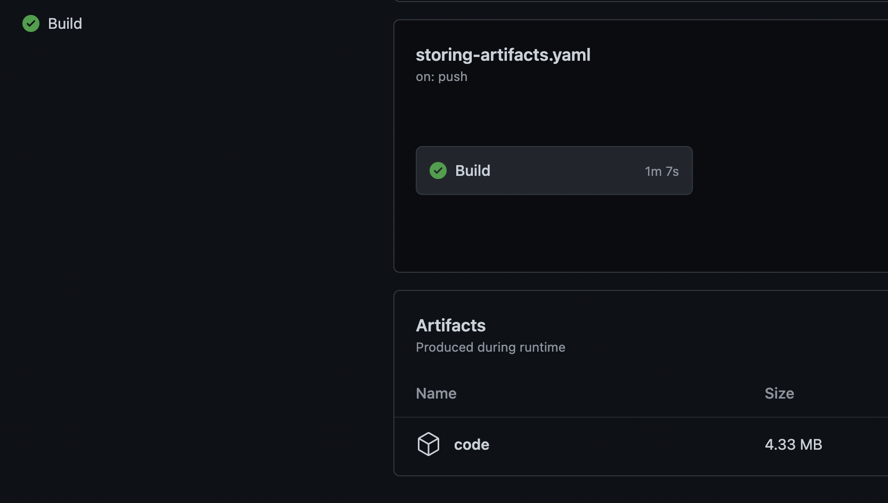

## Storing artifacts

It is possible to store artifacts in Github Actions.
The `artifact` is the result of the build, in this case the complied code.

> This should not be mistaken for proper `artifact management`, but it is useful for making the artifacts built by the pipeline available.

To upload artifacts use the following syntax:

```YAML
- name: Upload a Build Artifact
  uses: actions/upload-artifact@v2
  with:
    name: my-artifact
    path: path/to/artifact/
```

As artifacts can be uploaded they can also be downloaded from Github Actions as:

```YAML
- name: Download a single artifact
  uses: actions/download-artifact@v2
  with:
    name: my-artifact
    path: path/to/download/artifact/
```

This information will be needed in next exercises.

More information about storing artifacts: https://docs.github.com/en/actions/guides/storing-workflow-data-as-artifacts

### Tasks

We want to add a step that builds all of the code, and them makes the compiled code available for other steps to use.

In order to achieve this we will simply save the state of the entire repository after running the build script.

1. Add step named `Upload Repo` to the existing job, which will upload an artifact with the name `code`, with the path `.` to use the current directory.

If all works out fine, your newest build should show something like:


### Resources

https://docs.github.com/en/actions/guides/storing-workflow-data-as-artifacts
